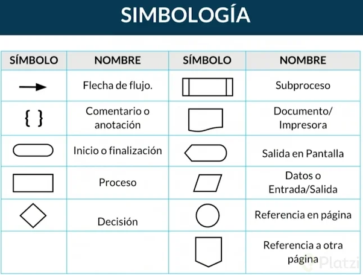

# Programar:

Es solucionar un problema de la vida real a través de una herramienta informatica que sea automatica.

# Algoritmo:

Es el conjunto de pasos ordenados y finito que usamos para plantearnos la solución del programa.

## Datos:

Es la unidad mínima de información. Son datos porque no contienen un significado propio. Información es un conjunto de datos agrupados y organizados.

- ENTERO: numerico que no posee  decimal.
- REAL: numerico que posee parte decimal.
- LOGICO: TRUE or FALSE
- CARACTTER: letras/caracteres.

## VARIABLES:

### Constantes: 

variables que no varían su valor en la ejecución del programa.

Las Variables en programación (al igual que en matemática) son valores que pueden cambiar durante un determinado período de tiempo; en el caso de la programación o los algoritmos, en el período de tiempo que dure la ejecución de un programa.  

- Pueden tener un solo tipo de dato.
- Su valor inicial es desconocido.
- Ocupa una posición en memoria.

### Reglas para Nombres de Variables:

- Representativo de lo que guarda o almacena.
- Debe comenzar con letras.
- No puede tener espacios en blanco.
- No puede tener simbolos especiales o de puntuacion.
- puede tener guion bajo.
- No pueden llamarse como las palabras reservadas.

# DECLARACION DE VARIABLES:

tipode dato + nombre variables

- ENTERO edad
- REAL estatura
- LOGICO tiene posición

- ENTERO edad, cant_hijos
- REAL estatura, peso
- LOGICO tiene_pc, es_recibido

## Asignacion de Valores:

- ENTERO edad <--- 0
- REAL estatura <--- "l"
- LOGICO tiene posición <--- TRUE

## OPERACIONES:

LECTURA: recibe datos, por teclado.
ESCRITURA: muestra datos, por pantalla

Pseudocódigo:

```// Pseudocódigo
entero edad
inicio
  leer edad
  escribir edad
fin
```

Al utilizar este formato, el código se mostrará con un fondo diferente y una fuente monoespaciada para resaltarlo del resto del texto en tu archivo .md. ¡Espero que esta información te sea útil! ¿Hay algo más en lo que pueda ayudarte?

# Operaciones Aritméticas con Variables

Las operaciones entre variables se dividen en tres categorías principales: aritméticas, relacionales y lógicas. Aquí tienes un resumen de cada una: 
 
1. Operaciones aritméticas: Estas operaciones se utilizan para realizar cálculos matemáticos básicos, como suma, resta, multiplicación y división. Algunos ejemplos de operaciones aritméticas son: 
   - Suma: a + b 
   - Resta: a - b 
   - Multiplicación: a * b 
   - Potencia: a ^ b
   - División: a / b 
   - Módulo (resto de la división): a % b 
 
2. Operaciones relacionales: Estas operaciones se utilizan para comparar valores y determinar si una relación es verdadera o falsa. Algunos ejemplos de operaciones relacionales son: 
   - Igualdad: a == b 
   - Desigualdad: a <> b 
   - Desigualdad: a ! b 
   - Mayor que: a > b 
   - Menor que: a < b 
   - Mayor o igual que: a >= b 
   - Menor o igual que: a <= b 
 
3. Operaciones lógicas: Estas operaciones se utilizan para combinar o modificar valores booleanos (verdadero o falso). Algunos ejemplos de operaciones lógicas son: 
   - AND lógico: a && b 
   - OR lógico: a || b 
   - NOT lógico: !a 
 
Estas son algunas de las operaciones más comunes que se realizan entre variables en programación. Cada tipo de operación tiene su propia sintaxis y reglas de uso, pero en general se utilizan para manipular y comparar valores de variables de diferentes maneras.

## EJEMPLOS




## Aritmeticas

Pseudocódigo:

```// suma
entero num1, num2, suma
inicio
  num1 <--- 5
  num2 <--- 10
  suma <--- num1 + num2
  escribir suma
fin
```

```// suma
entero num1, num2, suma
inicio
  leer (num1, num2)
  suma <--- num1 + num2
  escribir suma
fin
```

## Condicionales

### SI

```// suma
entero num1, num2
inicio
  num1 <--- 5
  num2 <--- 10
  si(num1>num2)entonces
   escribir("Es Mayor")
  fin si
fin
```
### SI - SINO

```// suma
entero num1, num2
inicio
  num1 <--- 5
  num2 <--- 10
  si(num1>num2)entonces
   escribir(num1, "Es Mayor")
  sino
   escribir(num1, "Es Menor")
  fin si
fin
```

